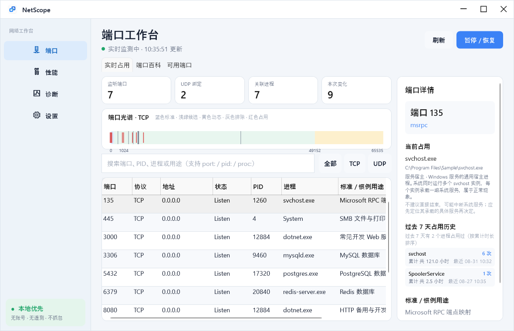
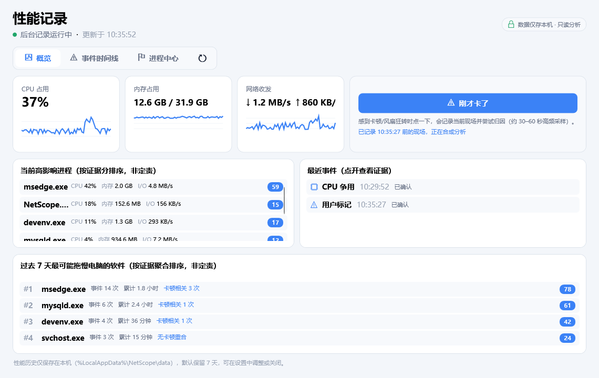
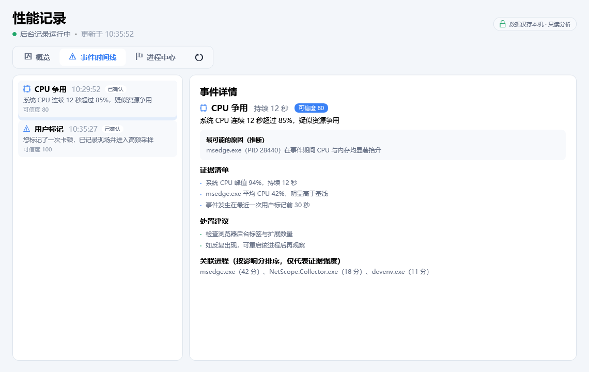
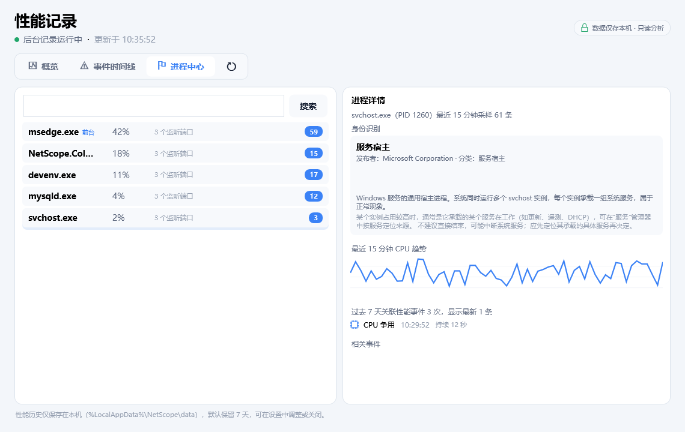

<p align="center"><a href="README.md">简体中文</a> · <b>English</b></p>

# NetScope

NetScope is a lightweight Windows 10/11 port management and network diagnostic tool with a Chinese interface. It keeps standard technical terms such as PID, TCP, UDP, DNS, DHCP and TLS; all core operations stay read-only.



## Feature overview

### Port workspace (default home page)

- Live TCP4, TCP6, UDP4 and UDP6 bindings, resolved to PID and process.
- Search by port, PID, process name, path or Chinese usage description, with `port:`, `pid:` and `proc:` prefixes.
- Bundled full IANA service registry, offline baseline service snapshot and 100+ Chinese descriptions for common ports; usage reflects standard or conventional purpose only and never infers actual traffic content.
- A dedicated "Port encyclopedia" for querying unoccupied ports, showing protocol, usage, common software, exposure risk and the current process.
- Port spectrum distinguishes standard ports, theoretical candidates, Windows dynamic ranges, system-excluded ports, high-risk ports, currently occupied ports and binding-verified results.
- Filters candidate ports from 1024–49151 and runs TCP/UDP, IPv4/IPv6 exclusive binding verification; results are always marked "currently recommended".

### Network diagnostics & speed test

- "Network diagnostics" and "Speed test" are two separate secondary workspaces: the former focuses on connectivity and fault evidence, the latter on real throughput, latency under load and Bufferbloat.
- Quick diagnostics for local machine, adapter/Wi-Fi, IP/DHCP, gateway, DNS, internet and all configured targets, with per-node status, evidence, confidence and recommendations.
- Gateway diagnostics collect 10 real ICMP samples in parallel and report average, P95, jitter and packet loss; results below 1 ms are not mis-shown as 0 ms.
- The diagnostics page keeps gateway timing, per-stage DNS/TCP/TLS latency and phase execution time separate, avoiding a misleading line chart built from heterogeneous samples.
- The active adapter is chosen by the Windows best route; APIPA is only evaluated for the adapter actually carrying traffic.
- Local link speed shows adapter name, media type and negotiated Wi-Fi Tx/Rx rates; virtual/VPN links are explicitly marked "not representative of public internet speed".
- A real speed test runs after user confirmation: adaptive download, upload, idle HTTP latency, download/upload load latency and a Bufferbloat grade.
- The real speed test uses Cloudflare edge speedtest endpoints, capped at roughly 62 MB per run, with progress, an overall timeout and cancel-anytime; NetScope neither uploads nor persists speedtest results.
- ICMP failure alone does not mean you are offline; the internet verdict combines DNS, TCP 443, TLS, NCSI and multi-target evidence.

### Performance recording & attribution (V0.2)

- A standalone "Performance" workspace between "Ports" and "Diagnostics" with three sub-pages: overview, event timeline and process center. See "What's new in V0.2".

### Interface & runtime

- The software opens the port workspace by default; a unified NetScope icon is wired into the EXE, installer, desktop/Start menu shortcuts, window title bar, taskbar and system tray.
- Native tray support, close-to-tray, per-user startup on login, system theme, Win11 Mica and Win10 solid-color fallback.
- Local settings and 3×1 MB sanitized rolling logs; no accounts, no telemetry, no packet-capture driver.

## What's new in V0.2: performance event recording and attribution

- A new standalone "Performance" workspace sits between "Ports" and "Diagnostics"; the default home page remains the port workspace.
- A background Collector process (`NetScope.Collector.exe`) is shipped in the same directory as the app and samples continuously: system and processes every 1 s, ports every 2 s; after a suspected performance event it automatically enters 30–60 s of 500 ms burst sampling.
- The "I just lagged" button marks the moment you feel lag into the event stream, joining the automatic rules in attribution ranking.
- The event engine ships 4 rules (CPU contention, memory pressure, IO pressure, network degradation) running through a Normal → Suspected → Capturing → Cooldown state machine with a cooldown to prevent event storms; every conclusion uses "possible/suspected" wording, backed by evidence and confidence.
- The Impact Score ranks suspect processes by CPU, memory, IO, foreground and user-mark proximity; it only orders evidence and never asserts causation.
- The event timeline shows 30 s before → during → after system context for each event; the process center plots per-process CPU/memory/IO curves over time and lists related events, with search.
- Performance history is written to `%LocalAppData%\NetScope\data\netscope.db` (SQLite/WAL); retention days are adjustable in settings (default 7, supports 1/7/14/30), and data older than 24 h is automatically downsampled to 30 s buckets.
- History is on by default and can be disabled in settings; recording, attribution and storage are fully local — nothing is uploaded and no account is required.

V0.2 records and attributes performance events; it still does not include traceroute, MTU or per-process real-time network bandwidth ranking.

## V0.3 new features: process identity and long-term impact

- Process knowledge base: 34 built-in profiles of common Windows system processes (svchost/dwm/MsMpEng/SearchIndexer/lsass/audiodg etc.). Select a process in the performance workspace "Process center" and the detail pane explains what it is, why it runs, what high usage means and whether it is safe to end.
- Third-party process recognition: unrecognized processes show executable description, publisher, product version and signature state; signature checking matches the Explorer "Digital Signatures" property page (embedded signature plus Windows catalog signature), fully offline.
- Metadata cache: verification results are cached in memory and in `%LocalAppData%\NetScope\cache\process-metadata.json`, keyed by path + modified time + size; unchanged files are never re-verified, so selecting the same process again costs nothing.
- Port occupancy history: the background records port sessions (one session = the same process holding the same port continuously, transient bindings filtered); the port detail pane shows who held port 8080 in the past 7 days, how many times and for how long.
- 7-day process events: the process detail pane lists how many performance events involved that process name in the past 7 days plus the latest records (aggregated by process name across PID instances).
- 7-day impact ranking: the overview page shows "software most likely to slow down your PC in the past 7 days", aggregating event frequency (45%), cumulative duration (30%) and overlap with user lag marks (25%); it orders evidence and never asserts causation.

Download the installer or portable build from [GitHub Releases](https://github.com/openkaiwu/NetScope/releases). See [Installation & usage guide](docs/安装与使用说明.md) for installation, icon and default-page details, the [development roadmap](docs/开发路线图.md) (Chinese) for product positioning, gap analysis and the version plan, and the [architecture guide](docs/架构说明.md) (Chinese) for how the current build is put together.

## Screenshots

<p align="center">
  
  
</p>
<p align="center">
  
  
</p>

## Project structure

```text
src/NetScope.App       WPF, MVVM, Fluent shell, tray and visualization controls
src/NetScope.Core      Domain models, search, diff, recommendations and diagnostics orchestration
src/NetScope.Windows   IP Helper, WLAN, network probes, settings, logging, performance sampling and history storage
src/NetScope.Collector Background performance event recorder (resident sampling + event engine + pipe IPC)
tests/NetScope.Tests   Core and Windows integration tests
```

## Build

The repository pins .NET SDK 10.0.302 via `global.json`.

```powershell
$dotnet = "$env:LOCALAPPDATA\NetScopeTools\dotnet\dotnet.exe"
& $dotnet test .\NetScope.slnx -c Release
& .\scripts\package.ps1
```

`scripts/package.ps1` produces a self-contained `win-x64` portable ZIP; when Inno Setup 6 is installed it also produces a per-user installer. Development builds are explicitly marked unsigned; production releases need Authenticode signing once a certificate is available.

## Data & privacy

- Settings: `%LocalAppData%\NetScope\settings.json`
- Logs: `%LocalAppData%\NetScope\logs`, up to 3×1 MB
- Performance history: `%LocalAppData%\NetScope\data\netscope.db` (SQLite/WAL, default 7-day retention)
- Logs sanitize URL-, SSID-, MAC- and IP-shaped data
- Quick diagnostics only issue a few DNS, ICMP, TCP/TLS and NCSI requests after you click; no speedtest files are downloaded
- The real speed test requires explicit confirmation, transfers at most about 62 MB, sends requests to Cloudflare speedtest nodes, and results stay in the current view without being written to logs
- Performance sampling and history are stored only on this machine and never uploaded; the Collector never terminates processes and never modifies firewall or system network configuration

The port registry data can be refreshed from the official IANA registry via `scripts/update-iana.ps1`; the repository also ships an offline baseline service snapshot so lookups work without a network.
