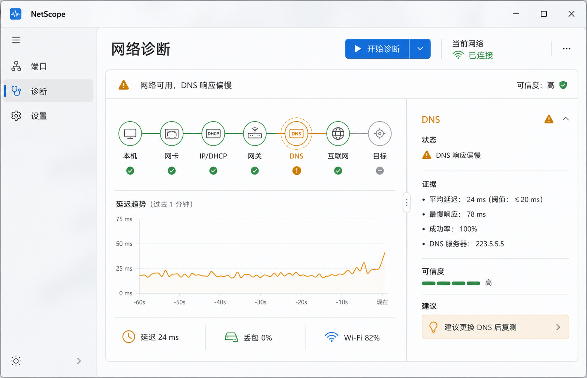

<p align="center"><b>简体中文</b> · <a href="README.en.md">English</a></p>

# NetScope

NetScope 是一款面向 Windows 10/11 的轻量端口管理与可视化网络诊断工具。界面使用中文，保留 PID、TCP、UDP、DNS、DHCP、TLS 等标准技术术语；核心操作保持只读。



## V0.1.5 能力

- 实时读取 TCP4、TCP6、UDP4、UDP6 绑定并定位 PID 与进程。
- 支持端口、PID、进程名、路径、中文用途以及 `port:`、`pid:`、`proc:` 搜索。
- 内置完整 IANA 服务注册表、离线基础服务快照与 100+ 条常用端口中文说明；用途仅表示标准或惯例用途，不推断真实流量内容。
- 独立“端口百科”可查询未占用端口，并同时展示协议、用途、常见软件、暴露风险和当前进程。
- 端口光谱区分标准端口、理论候选、Windows 动态范围、系统排除、高风险、当前占用与绑定验证结果。
- 从 1024–49151 中筛选候选端口，并执行 TCP/UDP、IPv4/IPv6 独占绑定验证；结果始终标注“当前推荐”。
- 快速诊断本机、网卡/Wi-Fi、IP/DHCP、网关、DNS、互联网与全部配置目标，逐节点输出状态、证据、可信度和建议。
- “网络诊断”和“网速测试”是两个独立二级工作区：前者专注连通性与故障证据，后者专注真实吞吐、负载延迟和 Bufferbloat；两者不再混排在一个长页面中。
- 软件默认打开端口工作台；统一的 NetScope 图标已接入 EXE、安装程序、桌面/开始菜单快捷方式、窗口标题栏、任务栏和系统托盘。
- 活动网卡按 Windows 最佳路由选择；APIPA 仅针对实际承载流量的网卡判断。
- 网关诊断并行采集 10 个真实 ICMP 样本，输出平均值、P95、抖动和丢包；小于 1ms 的结果不会误显示为 0ms。
- 诊断页将网关时序、DNS/TCP/TLS 分项耗时和阶段执行时间分开，避免把异构样本连成一条误导性的折线。
- 本地链路速率显示网卡名称、媒介类型与 Wi-Fi 收发协商值；虚拟/VPN 链路会明确标注“不代表公网速度”。
- 用户确认后可运行真实测速：自适应下载、上传、空闲 HTTP 延迟、下载/上传负载延迟以及 Bufferbloat 等级。
- 真实测速使用 Cloudflare 边缘测速端点，单次流量上限约 62MB，支持进度、总超时和随时取消；NetScope 不上传或持久化测速结果。
- ICMP 失败不会单独判定断网；互联网结论结合 DNS、TCP 443、TLS、NCSI 与多目标证据。
- 支持原生托盘、关闭到托盘、当前用户开机启动、系统主题、Win11 Mica 与 Win10 实色降级。
- 本地设置与 3×1MB 脱敏滚动日志；无账号、无遥测、无抓包驱动。

V0.1.5 仍不包含路由追踪、MTU、网络历史或逐进程带宽排行。当前测速结果表示“本机到所选边缘节点”的当次表现，不等同于运营商标称带宽，也不会在后台自动运行。

## V0.2 性能事件记录与归因

- 新增独立的“性能”工作区，位于“端口”与“诊断”之间；默认首页仍是端口工作台。
- 后台 Collector 进程（`NetScope.Collector.exe`）随 App 同目录发布并常驻采样：系统与进程 1 秒、端口 2 秒；检测到疑似性能事件后自动进入 30–60 秒的 500ms 突发采样。
- “刚才卡了”按钮把用户感受到的卡顿标记到事件流，与自动规则一起参与归因排序。
- 事件引擎内置 4 条规则（CPU 争用、内存压力、IO 压力、网络劣化），经“正常 → 疑似 → 捕捉中 → 冷却”状态机运行，带冷却时间防止事件风暴；结论一律使用“可能/疑似”措辞，并附证据与可信度。
- 影响度评分（Impact Score）综合 CPU、内存、IO、前台进程和用户标记位置对嫌疑进程排序；只排列证据、不下因果结论。
- 事件时间线展示每个事件前 30 秒 → 发生中 → 后 30 秒的系统上下文；进程中心按时间曲线展示进程 CPU/内存/IO，并列出相关事件，支持搜索。
- 性能历史写入 `%LocalAppData%\NetScope\data\netscope.db`（SQLite/WAL）；保留天数可在设置中调整（默认 7 天，支持 1/7/14/30），超过 24 小时的数据自动降采样为 30 秒粒度。
- 历史记录默认开启，可在设置中关闭；记录、归因与存储全部本地完成，不上传、无账号。

V0.2 记录并归因性能事件，仍不包含路由追踪、MTU 与逐进程实时网络带宽排行。

安装、图标和默认页面说明见 [安装与使用说明](docs/安装与使用说明.md)。

## 工程结构

```text
src/NetScope.App       WPF、MVVM、Fluent 外壳、托盘与可视化控件
src/NetScope.Core      领域模型、搜索、差异计算、推荐与诊断编排
src/NetScope.Windows   IP Helper、WLAN、网络探针、设置、日志、性能采样与历史存储
src/NetScope.Collector 后台性能事件记录器（常驻采样 + 事件引擎 + 管道 IPC）
tests/NetScope.Tests   核心与 Windows 集成测试
```

## 构建

仓库通过 `global.json` 固定 .NET SDK 10.0.302。

```powershell
$dotnet = "$env:LOCALAPPDATA\NetScopeTools\dotnet\dotnet.exe"
& $dotnet test .\NetScope.slnx -c Release
& .\scripts\package.ps1
```

`scripts/package.ps1` 会生成自包含 `win-x64` 便携 ZIP；安装了 Inno Setup 6 时也会生成当前用户级安装包。开发包明确标记为未签名，生产发布需在提供证书后执行 Authenticode 签名。

## 数据与隐私

- 设置：`%LocalAppData%\NetScope\settings.json`
- 日志：`%LocalAppData%\NetScope\logs`，最多 3×1MB
- 性能历史：`%LocalAppData%\NetScope\data\netscope.db`（SQLite/WAL，默认保留 7 天）
- 日志会脱敏 URL、SSID、MAC 与 IP 形式的数据
- 快速诊断仅在用户点击后发起少量 DNS、ICMP、TCP/TLS 与 NCSI 请求，不下载测速文件
- 真实测速必须单独确认，最多传输约 62MB；请求发送到 Cloudflare 测速节点，结果只保存在当前界面且不会写入日志
- 性能采样与历史记录仅保存在本机，不上传；Collector 不会结束进程、不修改防火墙或系统网络配置

端口注册数据可通过 `scripts/update-iana.ps1` 从 IANA 官方注册表刷新；仓库同时携带离线基础服务快照，确保无网络时仍可查询。
