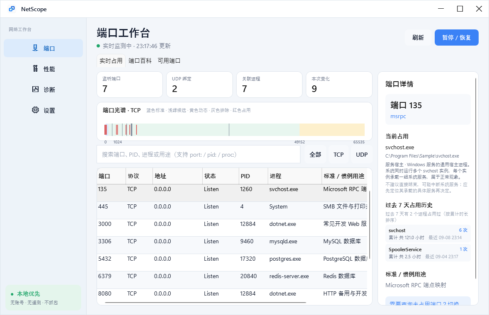
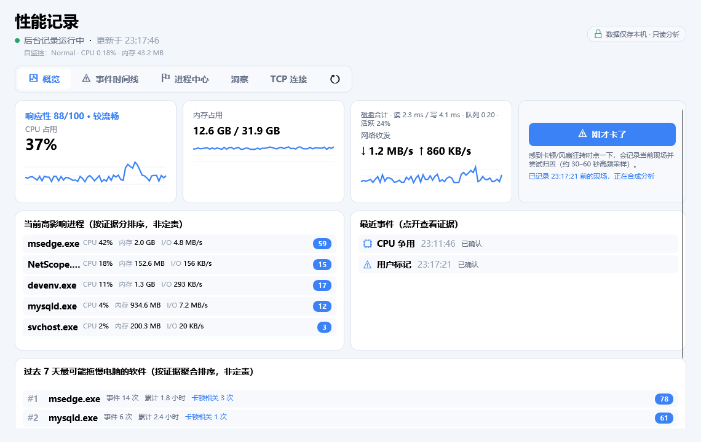
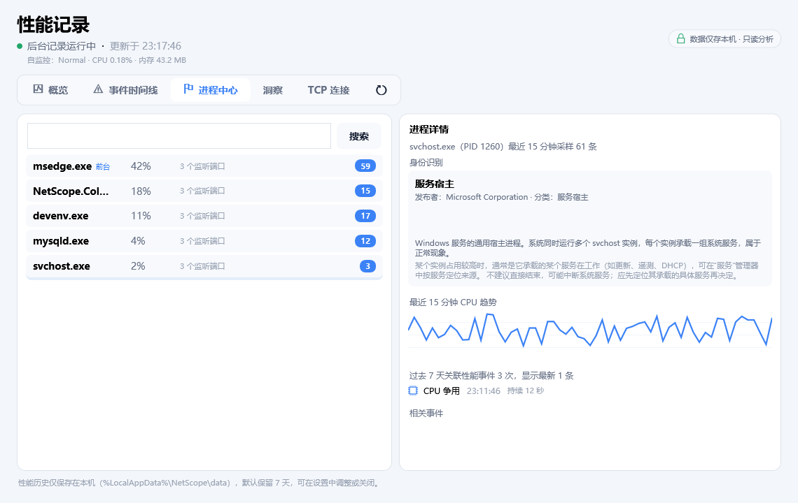

<p align="center"><b>简体中文</b> · <a href="README.en.md">English</a></p>

# NetScope

NetScope 是一款面向 Windows 10/11 的轻量端口管理与可视化网络诊断工具。界面使用中文，保留 PID、TCP、UDP、DNS、DHCP、TLS 等标准技术术语；核心操作保持只读。



## 功能总览

### 端口工作台（默认首页）

- 实时读取 TCP4、TCP6、UDP4、UDP6 绑定并定位 PID 与进程。
- 支持端口、PID、进程名、路径、中文用途以及 `port:`、`pid:`、`proc:` 搜索。
- 内置完整 IANA 服务注册表、离线基础服务快照与 100+ 条常用端口中文说明；用途仅表示标准或惯例用途，不推断真实流量内容。
- 独立“端口百科”可查询未占用端口，并同时展示协议、用途、常见软件、暴露风险和当前进程。
- 端口光谱区分标准端口、理论候选、Windows 动态范围、系统排除、高风险、当前占用与绑定验证结果。
- 从 1024–49151 中筛选候选端口，并执行 TCP/UDP、IPv4/IPv6 独占绑定验证；结果始终标注“当前推荐”。

### 网络诊断与网速测试

- “网络诊断”和“网速测试”是两个独立二级工作区：前者专注连通性与故障证据，后者专注真实吞吐、负载延迟和 Bufferbloat。
- 快速诊断本机、网卡/Wi-Fi、IP/DHCP、网关、DNS、互联网与全部配置目标，逐节点输出状态、证据、可信度和建议。
- 网关诊断并行采集 10 个真实 ICMP 样本，输出平均值、P95、抖动和丢包；小于 1ms 的结果不会误显示为 0ms。
- 诊断页将网关时序、DNS/TCP/TLS 分项耗时和阶段执行时间分开，避免把异构样本连成一条误导性的折线。
- 活动网卡按 Windows 最佳路由选择；APIPA 仅针对实际承载流量的网卡判断。
- 本地链路速率显示网卡名称、媒介类型与 Wi-Fi 收发协商值；虚拟/VPN 链路会明确标注“不代表公网速度”。
- 用户确认后可运行真实测速：自适应下载、上传、空闲 HTTP 延迟、下载/上传负载延迟以及 Bufferbloat 等级。
- 真实测速使用 Cloudflare 边缘测速端点，单次流量上限约 62MB，支持进度、总超时和随时取消；NetScope 不上传或持久化测速结果。
- ICMP 失败不会单独判定断网；互联网结论结合 DNS、TCP 443、TLS、NCSI 与多目标证据。

### 性能记录、归因与洞察（V0.6）

- 独立“性能”工作区提供总览、事件时间线、进程中心、Insights 与 TCP 连接五个子页，覆盖实时状态、历史证据和长期行为分析。

### 界面与运行

- 软件默认打开端口工作台；统一的 NetScope 图标已接入 EXE、安装程序、桌面/开始菜单快捷方式、窗口标题栏、任务栏和系统托盘。
- 支持原生托盘、关闭到托盘、当前用户开机启动、系统主题、Win11 Mica 与 Win10 实色降级。
- 本地设置与 3×1MB 脱敏滚动日志；无账号、无遥测、无抓包驱动。

## V0.2 新增功能：性能事件记录与归因

- 新增独立的“性能”工作区，位于“端口”与“诊断”之间；默认首页仍是端口工作台。
- 后台 Collector 进程（`NetScope.Collector.exe`）随 App 同目录发布并常驻采样：系统与进程 1 秒、端口 2 秒；检测到疑似性能事件后自动进入 30–60 秒的 500ms 突发采样。
- “刚才卡了”按钮把用户感受到的卡顿标记到事件流，与自动规则一起参与归因排序。
- 事件引擎内置 4 条规则（CPU 争用、内存压力、IO 压力、网络劣化），经“正常 → 疑似 → 捕捉中 → 冷却”状态机运行，带冷却时间防止事件风暴；结论一律使用“可能/疑似”措辞，并附证据与可信度。
- 影响度评分（Impact Score）综合 CPU、内存、IO、前台进程和用户标记位置对嫌疑进程排序；只排列证据、不下因果结论。
- 事件时间线展示每个事件前 30 秒 → 发生中 → 后 30 秒的系统上下文；进程中心按时间曲线展示进程 CPU/内存/IO，并列出相关事件，支持搜索。
- 性能历史写入 `%LocalAppData%\NetScope\data\netscope.db`（SQLite/WAL）；保留天数可在设置中调整（默认 7 天，支持 1/7/14/30），超过 24 小时的数据自动降采样为 30 秒粒度。
- 历史记录默认开启，可在设置中关闭；记录、归因与存储全部本地完成，不上传、无账号。

V0.2 记录并归因性能事件，仍不包含路由追踪、MTU 与逐进程实时网络带宽排行。

## V0.3 新增功能：进程身份识别与长期影响

- 进程身份知识库：内置 34 条 Windows 常见系统进程说明（svchost/dwm/MsMpEng/SearchIndexer/lsass/audiodg 等），在性能工作区“进程中心”选中进程后，详情面板显示“这是什么、为什么在运行、高占用意味着什么、能不能结束”。
- 第三方进程自动识别：未收录进程显示可执行文件描述、发布者、产品版本与数字签名状态；签名验证与资源管理器“数字签名”属性页一致（嵌入式签名 + Windows 目录签名两级），仅本地验证、不联网。
- 元数据缓存：验证结果按“可执行路径 + 修改时间 + 文件大小”缓存在内存与 `%LocalAppData%\NetScope\cache\process-metadata.json`，文件未变不重复验证，重复选择同一进程零开销。
- 端口占用史：后台自动记录端口会话（同一进程连续占用同一端口记一次，过滤瞬态绑定），端口详情面板展示“过去 7 天谁占过 8080、各占几次、累计多久”。
- 进程 7 天事件：进程详情展示该进程名过去 7 天关联的性能事件次数与最新记录（跨 PID 实例按进程名聚合）。
- 7 天影响排行：概览页“过去 7 天最可能拖慢电脑的软件”榜单，聚合事件频率（45%）、累计时长（30%）与卡顿标记重合（25%）；只排序证据、不下因果结论。

安装包与便携版在 [GitHub Releases](https://github.com/openkaiwu/NetScope/releases) 下载；安装、图标和默认页面说明见 [安装与使用说明](docs/安装与使用说明.md)；产品定位、差距分析与后续版本规划见 [开发路线图](docs/开发路线图.md)；当前实际架构见 [架构说明](docs/架构说明.md)。

## V0.4 新增功能：分析深化（本地开发版）

- **相对 CPU 异常检测**：按 PID + 启动时间维护 EWMA 与中位数/MAD 基线，学习至少 30 秒；相对突增持续 5 秒后进入事件时间线，带冷却。首次启动和重启后重新学习；当前不包含内存泄漏或逐进程网络异常模型。
- **响应性评分 0–100**：性能概览展示资源压力估计，综合 CPU、内存、磁盘、前台进程与最近卡顿标记；悬停查看扣分证据。它不是实测输入延迟，缺失磁盘指标时会明确标注证据不完整。
- **TCP 连接与历史**：性能页新增 TCP 连接子页，显示 IPv4/IPv6 的进程、PID、本地/远端 IP 和端口、最后状态及首次/最后/结束观察时间；支持搜索与按进程、远端 IP、远端端口分组。默认显示最近 7 天最多 300 条，历史随设置保留，关闭历史不新增磁盘记录。
- **磁盘压力增强**：PDH 采集物理磁盘合计读写延迟、平均队列及活跃百分比；延迟 ≥50ms 或活跃 ≥90% 且队列 ≥2 持续 10 秒也可触发疑似磁盘事件，无需高吞吐。不可用时保留原有吞吐规则并说明证据缺失。
- 旧版 SQLite 数据库采用增量升级，保留 V0.3 数据；新指标和响应性证据随系统历史存储。

连接时间是轮询观察边界，不是精确握手/断开时间，短连接可能漏记；采集器退出或重启标注“后续状态未知”。详情和验收记录见 [V0.4 实现说明](docs/V0.4实现说明.md)。GitHub 已发布版本仍以 Releases 页面为准。

## V0.5–V0.6 新增功能：自监控、长期行为与 Insights（本地开发版）

- **Collector 自监控与保护**：性能页持续显示 Collector 自身 CPU、私有内存、工作集、磁盘读写与单次采样耗时。内存预算按进程独占的私有提交量判断，避免把 .NET 共享代码页误算为自身负担；连续超预算后按 Normal → Reduced → Minimal 分级降低采样频率，恢复时使用滞回逐级升频。
- **长列表保护**：进程、事件、连接和 Insights 列表启用回收式虚拟化；进程文件元数据与签名仍在用户选中后异步读取并命中缓存。
- **内存增长趋势**：按“PID + 启动时间”隔离进程实例，以观察窗口、总增长、线性斜率、拟合度和非下降比例共同判断，避免把进程重启前后拼成一次泄漏；结论明确保留缓存增长等其他解释。
- **周期行为发现**：从 CPU/I/O 动态基线提取活动段，使用周期均值与离散系数识别更新、同步、索引等规律后台行为；持续高负载和不规则突发不会被标为周期任务。
- **Insights 页面**：汇总 7/14/30 天卡顿标记、重复事件、内存趋势、周期行为、端口会话与连接变化，支持进程名、时间范围和类型筛选；趋势洞察保留 PID、启动时间及原始窗口，可精确回查该实例的 CPU、私有内存和 I/O 曲线。
- **安全依赖更新**：SQLite 原生运行库固定到 `SQLitePCLRaw.lib.e_sqlite3 2.1.13`，替换带高严重性安全公告的 2.1.10。

实现与验收边界见 [V0.5–V0.6 实现说明](docs/V0.5-V0.6实现说明.md)。当前代码版本为 0.6.0，本次尚未创建 GitHub Release。

## 界面截图

<p align="center">
  
  
</p>
<p align="center">
  
  
</p>

## 工程结构

```text
src/NetScope.App       WPF、MVVM、Fluent 外壳、托盘与可视化控件
src/NetScope.Core      领域模型、搜索、差异计算、推荐与诊断编排
src/NetScope.Windows   IP Helper、WLAN、网络探针、设置、日志、性能采样与历史存储
src/NetScope.Collector 后台性能事件记录器（常驻采样 + 事件引擎 + 管道 IPC）
tests/NetScope.Tests   核心与 Windows 集成测试
```

## 构建

仓库通过 `global.json` 固定 .NET SDK 10.0.302。

```powershell
$dotnet = "$env:LOCALAPPDATA\NetScopeTools\dotnet\dotnet.exe"
& $dotnet test .\NetScope.slnx -c Release
& .\scripts\package.ps1
```

`scripts/package.ps1` 会生成自包含 `win-x64` 便携 ZIP；安装了 Inno Setup 6 时也会生成当前用户级安装包。开发包明确标记为未签名，生产发布需在提供证书后执行 Authenticode 签名。

## 数据与隐私

- 设置：`%LocalAppData%\NetScope\settings.json`
- 日志：`%LocalAppData%\NetScope\logs`，最多 3×1MB
- 性能历史：`%LocalAppData%\NetScope\data\netscope.db`（SQLite/WAL，默认保留 7 天）
- 日志会脱敏 URL、SSID、MAC 与 IP 形式的数据
- 快速诊断仅在用户点击后发起少量 DNS、ICMP、TCP/TLS 与 NCSI 请求，不下载测速文件
- 真实测速必须单独确认，最多传输约 62MB；请求发送到 Cloudflare 测速节点，结果只保存在当前界面且不会写入日志
- 性能采样与历史记录仅保存在本机，不上传；Collector 不会结束进程、不修改防火墙或系统网络配置

端口注册数据可通过 `scripts/update-iana.ps1` 从 IANA 官方注册表刷新；仓库同时携带离线基础服务快照，确保无网络时仍可查询。
