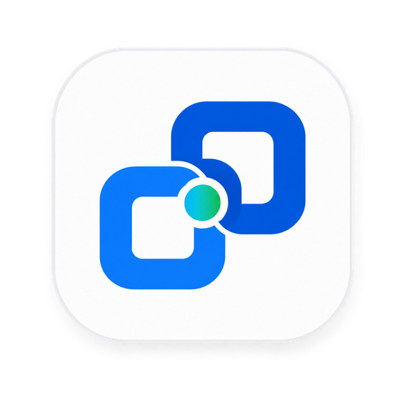
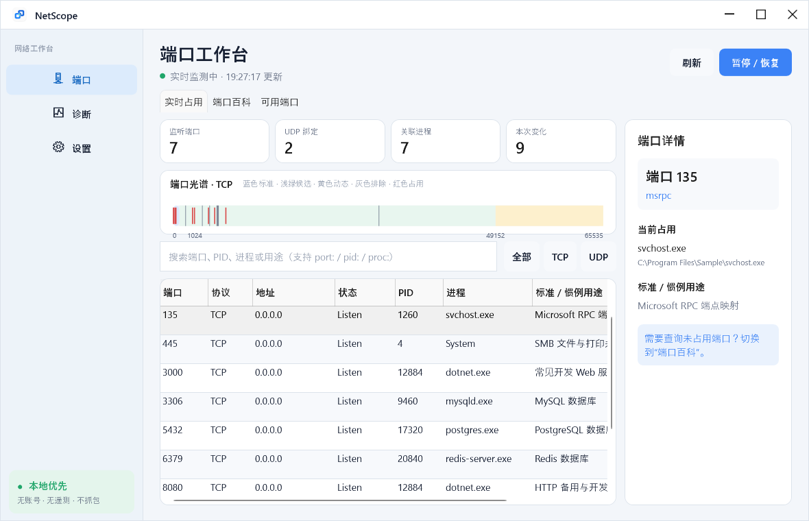

# NetScope V0.2.0 安装与使用说明

NetScope 是面向 Windows 10/11 的轻量端口管理与网络诊断工具。V0.2 在原有端口管理与网络诊断基础上，新增后台性能事件记录与归因能力；软件启动后的默认页面仍是“端口”。

## 应用图标

<p align="center">
  
</p>

图标采用白色圆角方底，两枚蓝色连接块表示端口与网络链路，中间的青绿色状态点表示实时监测和健康状态。整体参考常见 Windows 工具图标的简约比例，去掉了金属插座、发光和复杂纹理。

图标已经统一接入以下位置：

- `NetScope.exe` 的 Windows 应用图标。
- 安装程序自身的图标。
- 开始菜单中的 NetScope 快捷方式。
- 安装时可选创建的桌面快捷方式。
- 主窗口标题栏和任务栏。
- 静默后台运行时的系统托盘。

Windows ICO 文件包含 `16、20、24、32、40、48、64、128、256px` 九种尺寸，以适配资源管理器、桌面、任务栏、开始菜单和高 DPI 显示。

## 安装

### 安装版

1. 运行 `NetScope-0.2.0-win-x64-setup-unsigned.exe`。
2. 按安装向导完成安装；如需桌面入口，勾选“创建桌面快捷方式”。
3. 从桌面或开始菜单打开 NetScope。

从旧版本覆盖安装时，新的 EXE 与快捷方式都会使用 V0.1.5 图标；如果资源管理器暂时显示旧图标，这是 Windows 图标缓存尚未刷新，重新登录或重新创建快捷方式即可更新。

安装采用当前用户权限，默认目录是：

```text
%LocalAppData%\Programs\NetScope
```

开发构建尚未进行 Authenticode 签名，Windows 可能显示“未知发布者”。正式分发前应使用代码签名证书签名安装程序和主程序。

### 便携版

解压 `NetScope-0.2.0-win-x64-portable-unsigned.zip` 后运行 `NetScope.exe`。便携版为自包含 `win-x64` 构建，不需要预装 .NET。

## 性能工作区（V0.2）

左侧导航“端口”与“诊断”之间新增“性能”入口，包含三个二级页面：

- **总览**：实时 CPU、内存、网络占用曲线；按影响度排名的 Top 进程；“刚才卡了”按钮；最近性能事件。
- **事件**：按时间排列的性能事件列表，选中后展示事件前 30 秒 → 发生中 → 后 30 秒的系统上下文、证据、最可能原因、可信度与建议，以及按影响度排序的嫌疑进程。
- **进程**：搜索进程后查看其 CPU/内存/IO 时间曲线、相关性能事件和端口占用，以及下方“身份识别”卡片。

### 进程身份识别（V0.3）

在“性能 → 进程”中选中任意进程，详情面板会回答“这是什么”：

- **Windows 系统进程**：内置知识库直接说明该进程是什么、为什么在运行、高占用通常意味着什么、是否建议结束（覆盖 svchost、dwm、MsMpEng、SearchIndexer、lsass、audiodg 等 30+ 条常见系统进程）。
- **第三方进程**：显示可执行文件的描述、发布者、产品与版本，以及数字签名验证结果（有效 / 未签名 / 无法验证）。签名验证与资源管理器“数字签名”属性页一致，同时支持嵌入式签名与 Windows 目录签名（系统文件），全部本地完成、不联网。
- **缓存**：验证结果按“可执行路径 + 修改时间 + 文件大小”缓存于 `%LocalAppData%\NetScope\cache\process-metadata.json`；文件未被替换时不会重复验证，同一进程重复选中零开销。

端口工作台的“实时占用”详情面板同样会显示占用进程的知识库说明与签名状态。

### “刚才卡了”按钮

当你感觉电脑卡顿时，在性能页点击“刚才卡了”，NetScope 会把该时刻标记为一次用户反馈事件，并在归因排序时提高其附近进程的权重。该按钮只做记录，不会结束任何进程。

### 性能事件规则

事件引擎内置 4 条自动规则：CPU 争用、内存压力、IO 压力、网络劣化。规则需要条件持续约 10 秒才判定事件，判定后进入 30–60 秒 500ms 突发采样，并通过冷却时间避免事件风暴。所有结论都使用“可能/疑似”措辞，附证据与可信度，只做归因、不下因果结论。

### 历史记录

性能历史默认开启，写入：

```text
%LocalAppData%\NetScope\data\netscope.db
```

可在“设置 → 性能历史记录”中关闭历史记录、调整保留天数（1/7/14/30 天，默认 7 天）或关闭后台采样。设置修改约 15 秒内由后台 Collector 热加载。超过 24 小时的数据会自动降采样为 30 秒粒度以控制体积；数据库损坏时会保留损坏副本并自动重建。

## 默认启动页面

NetScope 现在默认打开“端口”工作台，而不是诊断页面。



上图由 Release WPF 主窗口直接渲染，布局、图标和默认导航均来自实际程序；端口表中的 PID 与进程为视觉测试示例数据。

端口工作台包含三个二级页面：

- **实时占用**：查看 TCP/UDP、IPv4/IPv6、本地地址、PID、进程和标准用途。
- **端口百科**：查询未被占用的端口，例如 `22 / SSH`、`80 / HTTP` 和 `443 / HTTPS`。
- **可用端口**：筛选当前推荐、理论候选、动态端口、系统排除、当前占用和高风险范围。

搜索框支持端口、PID、进程名、路径和中文用途，也支持：

```text
port:8080
pid:1234
proc:dotnet
```

## 网络诊断与测速

左侧“诊断”入口内部继续分为两个独立工作区：

- **网络诊断**：检查本机、网卡/Wi-Fi、IP/DHCP、网关、DNS、互联网和目标证据，不执行下载测速。
- **网速测试**：经用户确认后测量下载、上传、空闲延迟、负载延迟和 Bufferbloat。

真实测速最多产生约 62MB 流量，不会自动运行，也不会持久化测速结果。

## 后台运行

- 默认关闭主窗口后继续在托盘运行。
- 双击托盘图标可恢复窗口。
- 托盘菜单支持打开、暂停/恢复刷新、立即刷新和退出。
- 开机启动默认关闭，可在“设置”中启用当前用户级自启动。
- 性能采样由独立的 `NetScope.Collector.exe` 后台进程完成（随 App 同目录安装），单实例运行，通过命名管道与界面通信；App 启动时会自动拉起 Collector，退出时 Collector 继续独立采样。

## 数据与隐私

- 无账号、无遥测、无抓包驱动。
- 设置保存在 `%LocalAppData%\NetScope\settings.json`。
- 日志位于 `%LocalAppData%\NetScope\logs`，最多保留 `3×1MB`。
- 性能历史位于 `%LocalAppData%\NetScope\data\netscope.db`，默认保留 7 天；采样与归因全部在本机完成，不上传。
- 日志不会记录完整 URL、SSID、MAC 或公网 IP。
- 端口管理保持只读，不结束进程、不修改防火墙或系统网络配置；Collector 同样不会结束进程。

## 图标资产与再生成

当前原始图标：`design/assets/netscope-icon-source-v2.png`

旧版原始图标保留在：`design/assets/netscope-icon-source-v1.png`

应用资产：

```text
src/NetScope.App/Assets/NetScope.png
src/NetScope.App/Assets/NetScope.ico
```

重新生成多尺寸 ICO：

```powershell
python .\scripts\build-icon.py
```

图标由内置图像生成工具创建，最终生成提示词为：

> 参考两枚白色圆角底、蓝色几何符号的 Windows 工具图标，为 NetScope 创建更简约的快捷方式图标；中心使用两枚互相连接的蓝色圆角块和一个小型青绿色状态点，保留大量白色留白。不要复制参考 Logo，不要文字、快捷方式箭头、插座、金属边框、金色触点、发光或复杂 3D 细节，并保证 16–48px 下仍具有清晰轮廓。

## 验证结果

- Release 应用编译：0 错误、0 警告。
- ICO 尺寸：9 种，覆盖 16–256px。
- Release WPF 默认启动页视觉检查：通过。
- 单元与集成测试：90/90 通过。
- 已发布包（含 Collector）的 IPC 冒烟测试：通过。
- 自动化测试与安装包构建结果记录在仓库发布说明中。
